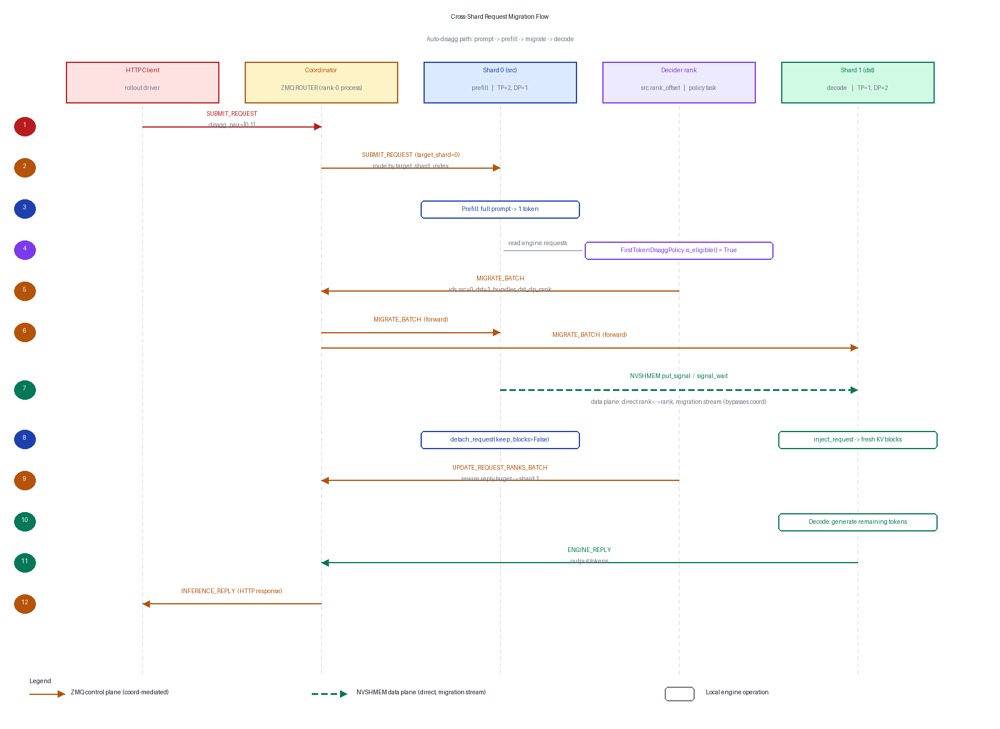

<!---
   Copyright (c) 2026, NVIDIA CORPORATION. All rights reserved.
-->

# Heterogeneous Inference Shards + Cross-Shard Request Migration

| | |
|---|---|
| **Status** | Implemented on `hetero-inference` branch |
| **Last updated** | 2026-05-07 |

## Contents

- [Summary](#summary)
- [Context](#context)
- [Goals](#goals)
- [Non-goals](#non-goals)
- [Architecture overview](#architecture-overview)
- [Detailed design](#detailed-design)
  - [Component map](#component-map)
  - [Lifecycle: auto-disagg](#lifecycle-auto-disagg)
  - [Lifecycle: tail-cut](#lifecycle-tail-cut)
  - [Length-aware HTTP routing](#length-aware-http-routing)
  - [Cross-shard groups and weight refit](#cross-shard-groups-and-weight-refit)
- [Alternatives considered](#alternatives-considered)
- [Configuration](#configuration)
- [Where to look in code](#where-to-look-in-code)
- [Risks and open questions](#risks-and-open-questions)
- [Future work](#future-work)

## Summary

Splits the RL rollout-time inference fleet into multiple **heterogeneous
shards** — independent `DynamicInferenceEngine`s with different
TP / PP / DP / EP configurations — coordinated by one shared
`DataParallelInferenceCoordinator`. In-flight requests migrate between
shards via one-sided NVSHMEM `put_signal` / `signal_wait` on a dedicated
stream, so neither the source nor destination engine pauses its run loop.
Eligibility is a pluggable `MigrationPolicy`; two policies ship today
(first-token disagg, tail-cut) and new triggers drop in as subclasses.

## Context

A single homogeneous inference engine forces a TP-vs-DP tradeoff that
fits neither prefill nor decode well, and RL rollout amplifies the
mismatch:

- **Prefill is compute-bound** on the prompt and scales well with TP;
  it finishes in one shot.
- **Decode is memory-bandwidth bound** and scales with DP; it runs many
  short steps to completion.
- **RL adds workload heterogeneity** on top: different envs produce
  rollouts with very different length distributions, prompt sizes, and
  expert-routing patterns. Each profile prefers a different parallelism
  configuration.

The standard fix for the prefill/decode split is **disaggregated
inference**: separate prefill replicas from decode replicas. Doing this
inside Megatron-RL means giving each replica an independent parallelism
spec and a way to hand off in-flight requests between them. The
hand-off has to be cheap enough to do per request, and asynchronous
enough not to stall either side's run loop.

## Goals

1. **Independent parallelism per inference replica.** Each shard runs
   its own TP/PP/DP/EP without paying the world-wide ``max(local_bytes)``
   memory tax of a single symmetric KV pool.
2. **Zero-pause cross-shard request migration.** Migration must overlap
   with the ongoing engine step; no engine.suspend / resume bracket on
   either side, no NCCL collective.
3. **Single shared coordinator.** All shards register with one
   `DataParallelInferenceCoordinator`; HTTP traffic, lifecycle control,
   and migration signaling all flow through one ZMQ ROUTER.
4. **Pluggable migration triggers.** The mechanism (transport,
   coord forwarding, engine surgery) is policy-agnostic so new triggers
   can be added without touching core code — primary research vehicle.
5. **No regression for the homogeneous path.** Single-shard rollout
   continues to work without any of the above.

## Non-goals

- **Heterogeneous Mamba.** v1 of cross-shard transport handles attention
  KV. Mamba state migration is feasible but deferred — would need a
  parallel transport for conv/SSM state with the same shape contract.
- **Migration during training.** Only the rollout / inference phase
  uses migration. Training-time weight movement uses the existing
  refit path.
- **Replacing the homogeneous DP coordinator.** The shard-aware
  extensions are additive; pure-homogeneous deployments behave
  identically to before.
- **Cross-node migration optimization.** v1 uses NVSHMEM as configured;
  cross-node `put_signal` works, but throughput tuning is left to
  follow-up work.

## Architecture overview

```
        +--------------------------------------------------------+
        |        DataParallelInferenceCoordinator                |
        |   (ZMQ ROUTER — control plane only, no KV bytes)       |
        +--------------------------------------------------------+
            ^               ^                  ^               ^
            |  SUBMIT       |  MIGRATE_BATCH   |  UPDATE_RANK  |  PAUSE/RESUME
            v               v                  v               v
   +-----------------+ +-----------------+ +-----------------+
   |    Shard 0      | |    Shard 1      | |    Shard 2      |
   |  spec: TP=2,DP=1| |  spec: TP=1,DP=2| |  spec: TP=2,DP=1|
   |                 | |                 | |                 |
   |  DynamicEngine  | |  DynamicEngine  | |  DynamicEngine  |
   |  HTTP server    | |  HTTP server    | |  HTTP server    |
   |                 | |                 | |                 |
   |   ranks [0,1]   | |   ranks [2,3]   | |   ranks [4,5]   |
   +-----------------+ +-----------------+ +-----------------+
            |                  ^                  ^
            +-- KV via NVSHMEM put_signal --------+
                (data plane, direct rank<->rank,
                 migration stream, bypasses coord)
```

Two planes:

- **Control plane** — ZMQ over the shared coord. Carries SUBMIT,
  MIGRATE_BATCH, UPDATE_REQUEST_RANKS_BATCH, PAUSE/RESUME, and
  ENGINE_REPLY. No KV bytes ever flow through here.
- **Data plane** — direct rank-to-rank NVSHMEM. KV slices land via
  one-sided `put_signal` on a dedicated migration stream. The coord
  never sees the data.

Every rank participates in exactly one shard or none (idle). Within a
shard, ranks are laid out TP-major: `(tp_rank, pp_rank)` lives at
offset `pp_rank * tp_size + tp_rank` from the shard's `rank_offset`.

## Detailed design

### Component map

#### `megatron.core.inference.shards` — framework-agnostic primitives

- `InferenceShard` — dataclass for one shard: spec dict, `rank_offset`,
  `world_size`, and (only on ranks that own the shard) a
  `ProcessGroupCollection`.
- `build_inference_pg_collection(spec, rank_offset, world_size, ...)` —
  build the `ProcessGroupCollection` for a contiguous rank window.
- `build_inference_pg_collections_for_shards(total_world_size, shards)`
  — partition the world into N contiguous shards. World-collective.
- `build_cross_shard_group(shard_indices)` — torch process group
  spanning multiple shards' rank windows. Used by the resharding refit
  path; **not** by the migration data plane.

These are deliberately framework-agnostic so non-Megatron-RL consumers
(NeMo-RL, verl, etc.) can build heterogeneous inference fleets without
depending on `megatron.rl`.

#### `megatron.rl.parallel_utils` — RL-specific glue

- A module-level shard registry (`set_inference_shards`,
  `get_inference_shards`, `get_my_inference_shard`).
- Registry-driven wrappers (`build_cross_shard_group(indices)` reads
  the registry, `swap_weights_across_shards(...)` for refit).
- Re-exports the core symbols for back-compat.

#### `megatron.rl.inference.multi_shard.MegatronLocalMulti`

The rl-side fleet driver. One instance per rank, but only the rank's
own shard's engine and HTTP server are live. Owns:

- `_my_engine` — the local rank's `DynamicInferenceEngine`.
- `_lifecycle_client` — rank-0 `InferenceClient` for pause / resume /
  shutdown broadcast.
- `_shard_clients` — per-shard `InferenceClient`. On a shard's
  `rank_offset`, used by the migration scheduler to post
  `MIGRATE_BATCH` and `UPDATE_REQUEST_RANKS_BATCH` directly to the
  coord (no rank-0 round-trip).
- `_migration_meta` — pre-computed per `(src, dst)` shard pair: src/dst
  KV layouts, head/PP-layer offsets. Avoids paying the layout-build
  cost on every migration.
- `_migration_policies` — list of registered `MigrationPolicy`
  instances. One asyncio task per policy on its decider rank.
- `_disagg_dst_dp_counter` — round-robin counter (per `(src, dst)` pair)
  so consecutive migration batches spread across the dst shard's DP
  replicas.
- `_on_migrate_batch_signal` — the engine-side migration handler.
  Inlines the gather → put_signal → signal_wait → scatter loop on the
  migration stream.
- `_run_policy_loop(policy)` — generic per-tick scheduler. Polls
  `engine.requests`, asks `policy.is_eligible(request)` for each,
  bundles eligible ids up to `policy.max_batch_size`, and dispatches
  one `MIGRATE_BATCH`.

#### `megatron.rl.inference.migration_policy` — pluggable triggers

```python
@dataclass
class MigrationPolicy:
    src_shard_index: int
    dst_shard_index: int
    poll_interval_s: float = 0.05
    max_batch_size: int = 16

    def is_eligible(self, request) -> bool:
        ...  # subclasses override
```

Built-in policies:

- `FirstTokenDisaggPolicy` — fires once a request has produced its
  first decoded token *and* carries the opt-in `disagg_dst_shard_index`
  tag pointing at this policy's `dst_shard_index`.
- `TailCutPolicy(min_tokens=N)` — fires once a request has accumulated
  ≥ `min_tokens` decoded tokens *and* carries the opt-in
  `late_dst_shard_index` / `late_dst_min_tokens` tags. The per-request
  override of `min_tokens` lets traffic with different length
  distributions share a single tail-cut shard.

Multiple policies coexist; each runs as its own asyncio task on its
`src_shard_index`'s decider rank with its own `migrated_ids` memo.
Conflict resolution is first-fires-wins by virtue of the request
dropping out of `engine.requests` once migrated.

#### `megatron.core.inference.data_parallel_inference_coordinator`

Existing coord, extended for shard awareness:

- Engines register with a `shard_index` at CONNECT time.
- `SUBMIT_REQUEST` carries an optional `target_shard_index`.
- `MIGRATE_BATCH` payload is `[hdr, request_ids, src_shard_index,
  dst_shard_index, bundles, dst_dp_rank]`. Coord forwards the same wire
  payload to every rank in the src shard and to **only** the chosen
  dst dp_rank's ranks (not the whole dst shard).
- `UPDATE_REQUEST_RANK` / `UPDATE_REQUEST_RANKS_BATCH` rewrite
  `request_id_to_rank` and shift pending-count accounting so
  post-migration `ENGINE_REPLY` packets reach the original HTTP client.

#### `megatron.core.inference.engines.request_migration` — types + plan builder

- `RequestMigrationBundle` — msgpack-serializable envelope: tokens,
  sampling params, `generated_log_probs`, `kv_cache_epoch`,
  `policy_epoch`, `num_kv_blocks`, `last_block_offset`, `src_block_ids`,
  MoE `routing_indices_*`. KV layouts are *not* on the wire — the
  receiving handler restamps them from `_migration_meta`.
- `KVLayout` — TP/PP/head-count/block-size descriptor.
- `KVMigrationOp` — one tensor transfer: src/dst rank pair, layer
  range, head range, parallel src/dst block-id lists.
- `build_kv_migration_plan(bundle, src_global_rank_of,
  dst_global_rank_of, dst_block_ids)` — emits one op per
  `(src_pp, dst_pp, src_tp, dst_tp)` quadruple with non-empty
  layer × head intersection. Handles heterogeneous TP and PP
  (any reshape).

#### `megatron.core.inference.nvshmem_migration`

NVSHMEM module-level state and transport primitives:

- `maybe_init_nvshmem(group)` — initialize the symmetric heap, allocate
  the flag pool (`MIGRATION_FLAG_POOL_SIZE`, default 4096) and staging
  slot pool (`MIGRATION_STAGING_NUM_SLOTS`, default 64).
- `flag_slot_for(key)` — deterministic slot lookup. Both src and dst
  derive the same flag slot from `request_id * MAX_OPS_PER_REQ +
  op_index`, so partial-participation (one dst dp_rank per migration)
  is safe — no per-PE counter to drift.
- `put_slot_with_signal(slot_idx, flag_slot, dst_pe, ...)` — atomic
  one-sided put + flag set on dst.
- `wait_slot_signal(flag_slot, expected, stream)` — stream-ordered GPU
  wait on a flag.
- `migration_stream()` — the dedicated stream every migration kernel
  rides on, decoupled from compute.

KV / Mamba state buffers themselves are **not** in the symmetric heap;
only the fixed-size staging slots and flags are.

#### `megatron.core.inference.engines.dynamic_engine` — engine-side surgery

- `snapshot_request(req_id)` — produce a `RequestMigrationBundle` +
  the request's KV block ids without mutating anything.
- `inject_request(bundle)` — register the request on the destination
  engine in DECODE state with fresh KV blocks allocated.
- `detach_request(req_id, keep_blocks)` — remove from the active
  batch; `keep_blocks=True` keeps the block tensor alive for the
  migration orchestrator to release after transport completes.
- `set_migration_handler(callback)` — register the multi-shard
  `_on_migrate_batch_signal` handler.

### Lifecycle: auto-disagg

Triggered by submitting an HTTP request with `disagg_pair=[src, dst]`
(or by `MegatronLocalMulti`'s rollout-driver shortcut, which stamps
`disagg_pair` on every `base_generate` call when the auto-disagg gate
is configured).



Steps below match the numbered events in the diagram above.

1. **Client → Coord: `SUBMIT_REQUEST`.** HTTP request body carries
   `disagg_pair=[0, 1]`, which the client (or rollout driver) translates
   into `target_shard_index = 0`.
2. **Coord → Src engine: `SUBMIT_REQUEST`.** Coord routes by
   `target_shard_index`, picking a dp_rank within the src shard.
3. **Src: prefill.** Src engine runs the prompt and produces the first
   decoded token. The request now sits in src's active batch with a
   full KV cache.
4. **Decider: `policy.is_eligible() = True`.** The registered
   `FirstTokenDisaggPolicy` runs an asyncio task on the *decider rank*
   (src shard's `rank_offset`). Each tick it iterates the local
   `engine.requests` dict and asks `policy.is_eligible(request)` per
   request; tagged requests with ≥ 1 generated token become eligible.
5. **Decider → Coord: `MIGRATE_BATCH`.** `_run_policy_loop` collects
   eligible ids up to `policy.max_batch_size`, picks a dst dp_rank via
   the per-(src, dst) round-robin counter, snapshots each request into
   a bundle, and posts `MIGRATE_BATCH(request_ids, src_shard,
   dst_shard, bundles, dst_dp_rank)` through the shard's
   `InferenceClient`.
6. **Coord forwards `MIGRATE_BATCH`.** Same wire payload goes to every
   rank in the src shard *and* to the chosen dst dp_rank's ranks
   (not the whole dst shard). Other dst dp_ranks don't see this
   migration.
7. **Src ↔ Dst: NVSHMEM `put_signal` / `signal_wait`.** Each receiving
   rank pops the signal from `_pending_signals` and invokes
   `_on_migrate_batch_signal`. Bundles are deserialized; `src_layout` /
   `dst_layout` are restamped from `_migration_meta`. Every op walks in
   deterministic order: src gathers its KV slice into a symmetric
   staging slot and `put_slot_with_signal`s to the matching slot on dst,
   keyed by `(req_id * MAX_OPS_PER_REQ + op_idx)`; dst `signal_wait`s on
   the same flag and scatters the slot into its local KV buffer. All on
   the migration stream, parallel to compute.
8. **Src detach + Dst inject (parallel, both local).** Src calls
   `detach_request(req_id, keep_blocks=False)` to free stale src blocks
   and remove the request from its active batch. Dst calls
   `inject_request(bundle)` which allocates fresh KV blocks and
   registers the request in DECODE state.
9. **Decider → Coord: `UPDATE_REQUEST_RANKS_BATCH`.** Decider posts the
   batch so the coord rewrites `request_id_to_rank` and shifts
   pending-count accounting; future `ENGINE_REPLY` packets for these
   ids will route to the dst engine.
10. **Dst: decode.** Dst engine generates the remaining tokens
    normally — same code path as a request that started on dst.
11. **Dst → Coord: `ENGINE_REPLY`.** When generation finishes, dst
    posts the output tokens to the coord.
12. **Coord → Client: HTTP response.** Coord looks up the original
    client identity (kept stable through the rank rewire) and forwards
    the reply. The HTTP client never saw the migration.

Both engines remain live throughout: src finishes step N and moves on;
dst pops `MIGRATE_BATCH` off its queue between its own steps. The
NVSHMEM transport at step 7 runs on the migration stream, parallel to
compute on either side.

### Lifecycle: tail-cut

Same scheduler, same NVSHMEM transport, same coord rewire path — only
a different `MigrationPolicy`. `TailCutPolicy(src=decode_shard,
dst=tail_shard, min_tokens=N)` watches the decode shard's engine and
returns `True` for requests that have accumulated ≥ N decoded tokens
on it.

A request flowing through the full disagg + tail-cut topology visits
three shards: prefill on shard 0, decode on shard 1 (after
`FirstTokenDisaggPolicy` fires), then tail decode on shard 2 (after
`TailCutPolicy` fires once enough tokens accumulate on shard 1).

### Length-aware HTTP routing

When a request body sets `disagg_pair=[src, dst]` *and* its tokenized
prompt is shorter than `disagg_length_threshold`, the
`chat_completions` HTTP endpoint short-circuits the auto-disagg tag
and submits directly to the dst shard. Short prompts get decoded
immediately; only long-prompt traffic pays the migration cost.

This is an optimization on the HTTP side, not a migration policy.

### Cross-shard groups and weight refit

Cross-shard process groups are used by the rl-side weight refit path
(`swap_weights_across_shards`), which broadcasts trained weights from
the training PG into each inference shard's local PG. The migration
data path does **not** use a torch process group — direct NVSHMEM
makes that unnecessary.

The resharding plan-cache caches plans by `(rank, src_config,
dst_config, num_experts, dst_shard_signature)`. The
`dst_shard_signature=(rank_offset, world_size)` field disambiguates
plans across multiple destination shards. Without it, ranks idle in
one shard would build the plan twice while ranks active in another
shard would hit the cache once, imbalancing the second collective and
deadlocking ≥3-shard topologies.

## Alternatives considered

### NCCL `batch_isend_irecv` for the migration data path

Rejected. Migration would need a torch process group spanning the
union of src + dst rank windows, instantiated for every `(src, dst)`
pair. Collectives need synchronous participation from every rank in
the group on every operation, which forces both engines to pause their
run loops or to coordinate engine steps with migration ticks. NVSHMEM
`put_signal` is one-sided and rank-pair-scoped, so neither engine has
to stop.

### One coord per shard

Rejected. Each request needs to be routable to the chosen shard, and
its reply target may change after migration. Multiple coords would
need a meta-coordinator to route across them, plus a way to keep
`request_id_to_rank` consistent under migrations. A single ZMQ ROUTER
with shard-tagged registration keeps the shard-awareness logic local
to one process and lets `UPDATE_REQUEST_RANKS_BATCH` be a simple table
update.

### Coord-side migration scheduler

Rejected. The coord doesn't see request-level state (decoded-token
count, KV pressure, expert routing). Putting the scheduler on the rank
that owns the engine gives direct dict access and zero-RPC eligibility
checks. The decider rank is the only rank that needs to see the engine
state; everything else flows through the coord control channel.

### Single multi-policy loop

Rejected. Each policy can target a different src shard with a
different decider rank. A single loop would need to dispatch work
across decider ranks, reintroducing cross-rank coordination for what
is fundamentally a per-shard local concern. Independent asyncio tasks
keep each policy fully local.

### KV buffers in the NVSHMEM symmetric heap

Rejected after initial implementation. Putting the KV `memory_buffer`
in the symmetric heap requires `max(local_bytes)` allocation across
all PEs — a heterogeneous shard with a smaller KV pool pays for the
largest shard's footprint on every rank. With fixed-size symmetric
**staging slots** plus regular CUDA-tensor KV buffers, each shard
sizes its KV pool independently and only the staging slots live in
the symmetric heap.

## Configuration

CLI flags (in `megatron/training/arguments.py`):

| Flag | What it does |
|---|---|
| `--rl-inference-shards <spec>` | Shard layout, e.g. `tp=2,dp=1+tp=1,dp=2`. |
| `--rl-auto-disagg-src-shard <i>` | Stamp every rollout submit with `disagg_pair=[i, dst]`. |
| `--rl-auto-disagg-dst-shard <i>` | Decode shard for auto-disagg. |
| `--rl-disagg-length-threshold <n>` | Bypass migration for prompts shorter than `n` tokens. |
| `--rl-tail-cut-dst-shard <i>` | Where tail-cut sends slow requests. |
| `--rl-tail-cut-min-tokens <n>` | Min generated-tokens threshold to trigger tail-cut. |

Environment knobs:

| Env | What it does |
|---|---|
| `MIGRATION_FLAG_POOL_SIZE` | NVSHMEM flag pool depth (default 4096). |
| `MIGRATION_STAGING_NUM_SLOTS` | Staging slot count (default 64). |
| `MIGRATION_STAGING_SLOT_BYTES` | Per-slot byte size. |

## Where to look in code

- Shard primitives — `megatron/core/inference/shards.py`
- Fleet driver — `megatron/rl/inference/multi_shard.py`
- Migration policies + ABC — `megatron/rl/inference/migration_policy.py`
  (`MigrationPolicy`, `FirstTokenDisaggPolicy`, `TailCutPolicy`)
- Generic policy scheduler — `MegatronLocalMulti._run_policy_loop`
- Migration types + plan builder —
  `megatron/core/inference/engines/request_migration.py`
- NVSHMEM transport — `megatron/core/inference/nvshmem_migration.py`
- Engine surgery — `megatron/core/inference/engines/dynamic_engine.py`
  (`snapshot_request` / `inject_request` / `detach_request`)
- Engine-side migration handler —
  `MegatronLocalMulti._on_migrate_batch_signal`
- Coord shard awareness —
  `megatron/core/inference/data_parallel_inference_coordinator.py`
- Resharding cache fix — `megatron/core/resharding/refit.py`
  (`_PlanCacheKey.dst_shard_signature`)
- Length-aware HTTP routing —
  `megatron/core/inference/text_generation_server/dynamic_text_gen_server/endpoints/chat_completions.py`

## Risks and open questions

- **Symmetric-slot exhaustion.** The staging pool is statically sized
  (default 64 slots). A burst of concurrent migrations larger than the
  pool will block on slot acquisition. Tunable via env, but no current
  back-pressure signal back to the scheduler.
- **Single-coord SPOF.** Rank 0 owns the coord subprocess. If it
  crashes, the whole fleet stops. Inherited from the existing
  homogeneous design; not made worse here.
- **Resharding cache key assumes contiguous shards.** The
  `dst_shard_signature=(rank_offset, world_size)` tuple disambiguates
  contiguous shards. Non-contiguous rank windows (not supported today)
  would re-hit the original cache-collision case.
- **Policy composition is first-fires-wins.** Two policies on the same
  shard that target different dst shards for the same request will
  both fire, and the second becomes a no-op via `engine.requests`
  membership. There's no priority arbiter; if multiple policies turn
  out to fight in practice, an arbiter is the natural follow-up.
- **Mamba state migration not in v1.** Hybrid models can be sharded
  but in-flight migration of Mamba conv/SSM state is not implemented;
  hybrid migration silently moves only the attention KV.

## Future work

The migration mechanism is policy-agnostic: research progress on
*which requests to migrate when* lands as new `MigrationPolicy`
subclasses without touching the scheduler, the coord, or the engine
surgery. Open directions:

- **Decode-rate observation.** Track tokens/sec per request; migrate
  when rate drops below a shard-relative threshold. Catches requests
  stalled by KV pressure or expert-routing imbalance before a static
  `min_tokens` would.
- **Per-environment length prior.** Route requests from known-long-tail
  envs to the tail shard at prefill time rather than wasting N tokens
  of decode on the wrong shard first.
- **Dst-shard load awareness.** Skip migrations when the destination
  is also full. Today's policies don't read dst utilization.
- **MoE expert-imbalance score.** On EP-sharded shards, requests
  routing to cold experts pay a tax — move them to a shard with
  different expert placement.
- **Speculative-decode draft/verify split.** If the drafter and
  verifier live on different shards, a policy can swap requests
  between them based on acceptance rate.
- **Learned policy.** The eligibility hook is just a function — an
  RL-trained classifier or an online bandit can plug in.
- **Mamba state migration.** Add a parallel symmetric-staging path for
  conv / SSM state with the same NVSHMEM transport contract.
- **Cross-node throughput tuning.** v1 uses NVSHMEM as configured;
  cross-node `put_signal` works but hasn't been profiled.
